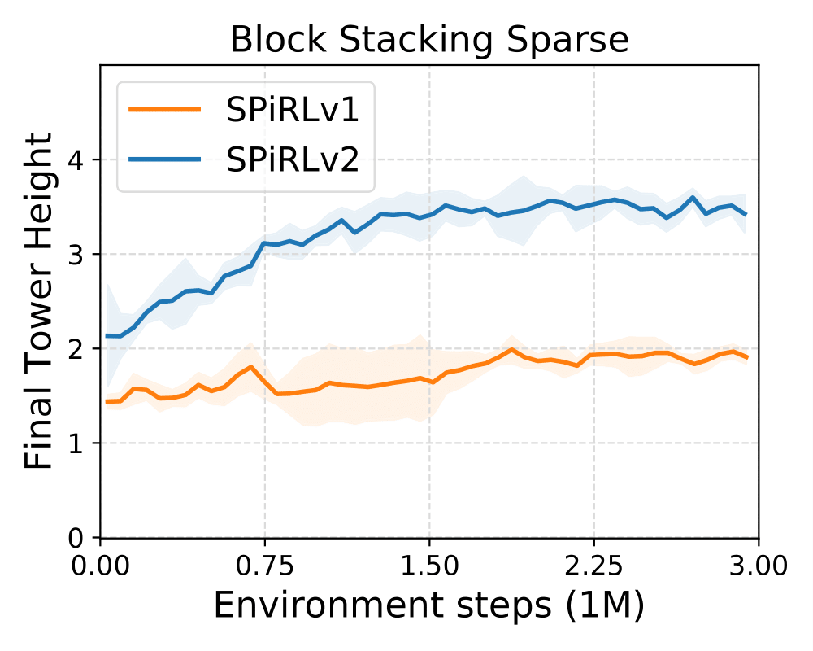

# Image-based SPiRL w/ Closed-Loop Skill Decoder

This version of the SPiRL model uses a [closed-loop action decoder](../../../../models/closed_loop_spirl_mdl.py#L55): 
in contrast to the original SPiRL model it takes the current environment observation as input in every skill decoding step. 

This image-based model is a direct extension of the 
[state-based SPiRL model with closed-loop skill decoder](../../kitchen/hierarchical_cl/README.md).
Similar to the state-based model we find that the image-based closed-loop model improves performance over the original
image-based SPiRL model, particularly in tasks that require precise control. 
We evaluate it on a more challenging, sparse reward version of the block stacking environment
where the agent is rewarded for the height of the tower it built, but does not receive any rewards for picking or lifting
blocks. We find that on this challenging environment, the closed-loop skill decoder ("SPiRLv2") outperforms the original
SPiRL model with open-loop skill decoder ("SPiRLv1").

<p align="center">

</p>
</img>

We also tried the closed-loop model on the image-based maze navigation task, but did not find it to improve performance,
which we attribute to the easier control task that does not require closed-loop control.

## Example Commands

To train the image-based SPiRL model with closed-loop action decoder on the block stacking environment, run the following command:
```
python3 spirl/train.py --path=spirl/configs/skill_prior_learning/block_stacking/hierarchical_cl --val_data_size=160
```

To train a downstream task policy with RL using the closed-loop image-based SPiRL model
on the sparse reward block stacking environment, run the following command:
```
python3 spirl/rl/train.py --path=spirl/configs/hrl/block_stacking/spirl_cl --seed=0 --prefix=SPIRLv2_block_stacking_seed0
```
