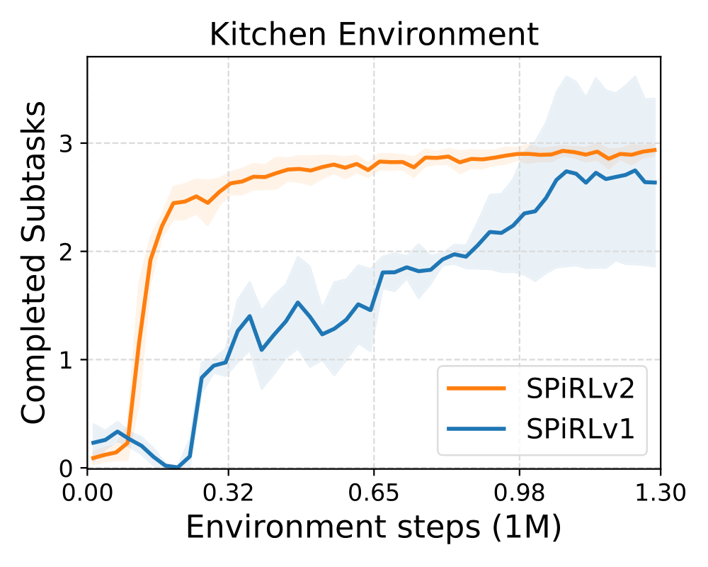

# SPiRL w/ Closed-Loop Skill Decoder

This version of the SPiRL model uses a [closed-loop action decoder](../../../../models/closed_loop_spirl_mdl.py): 
in contrast to the original SPiRL model it takes the current environment state as input in every skill decoding step. 

We find that this model improves performance over the original
SPiRL model, particularly on tasks that require precise control, like in the kitchen environment.

<p align="center">

</p>
</img>

## Example Commands

To train the SPiRL model with closed-loop action decoder on the kitchen environment, run the following command:
```
python3 spirl/train.py --path=spirl/configs/skill_prior_learning/kitchen/hierarchical_cl --val_data_size=160
```
Our current implementation of the closed-loop SPiRL model only supports state-based inputs, but an extension to
image observations is straightforward analogous to how we adapted the 
original SPiRL model for [image inputs](../../../../models/skill_prior_mdl.py#L321).

To train a downstream task policy with RL using the closed-loop SPiRL model we just trained, run the following command:
```
python3 spirl/rl/train.py --path=spirl/configs/hrl/kitchen/spirl_cl --seed=0 --prefix=SPIRLv2_kitchen_seed0
```
